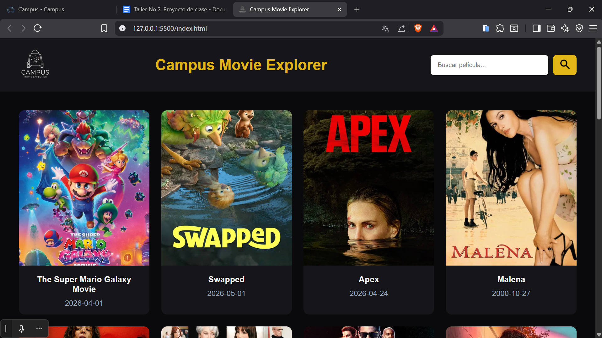
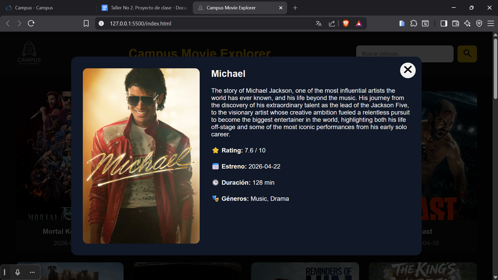
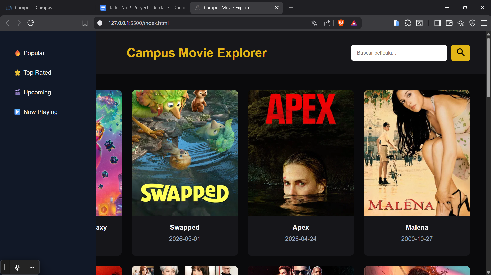

# 🎬 Campus Movie Explorer

Campus Movie Explorer es una aplicación web interactiva desarrollada con HTML, CSS y JavaScript puro que consume la API de The Movie Database (TMDB).

La aplicación permite explorar películas populares, buscar películas por nombre, navegar entre categorías y visualizar información detallada de cada película mediante un modal dinámico.

---

## ✨ Características

- Consumo de API pública con `fetch`
- Uso de `async/await`
- Renderizado dinámico de películas
- Sidebar con categorías
- Buscador funcional
- Modal de detalles
- Indicador de carga (loading spinner)
- Manejo básico de errores
- Diseño responsive

---

## 🛠️ Tecnologías utilizadas

- HTML5
- CSS3
- JavaScript
- TMDB API (https://developer.themoviedb.org)
- GitHub

---

## 📸 Screenshots

### Página principal



---

### Modal de detalles



---

### Sidebar de categorías



---

## 🚀 Cómo ejecutar el proyecto localmente

### 1. Clonar el repositorio

```bash
git clone https://https://github.com/canuxantonio502/TALLER_2.git
```
### 2. Abrir la carpeta del proyecto

```bash
cd TALLER_2
```
### 3. Crear el archivo config.js

Dentro de la carpeta js/, crear un archivo llamado
config.js y agregar lo siguiente:

```bash
export const API_KEY = "TU_API_KEY"
```

### 4. Ejecutar el proyecto

Abrir index.html con Live Server o cualquier servidor local.

---

📁 Estructura del proyecto

📦 TALLER_2    
 ┣ 📂 css  
 ┃ ┗ 📜 styles.css  
 ┃ ┣ 📂 assets  
 ┣ 📂 js  
 ┃ ┣ 📜 api.js  
 ┃ ┣ 📜 app.js  
 ┃ ┗ 📜 ui.js  
 ┣ 📜 index.html  
 ┗ 📖 README.md  
 ┗ 🚫 .gitignore  

---

### :feather: Autores

He aquí los responsables de que este proyecto se haya podido llevar a cabo:

* **Antonio Canux** - *Único colaborador* - [canuxantonio502](https://github.com/canuxantonio502)


